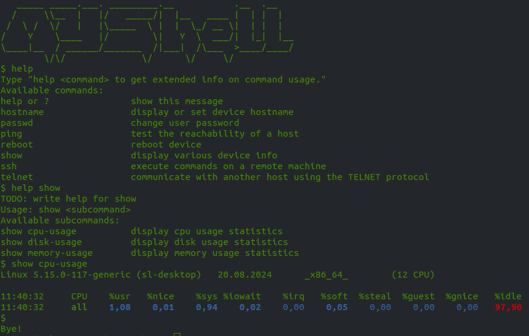

# MYShell

Sometimes a limited functionality shell is required for your own device. This project will help you quickly create such a shell.



## Project structure

```
myshell
  myshell
  banner
  config
  commands
    <command1>
      description.txt
      help.txt
      <command1>
    <command2>
      ...
    ...
```

myshell - executable file, the entry point to the shell.

In the subdirectory commands, directories are created for each command. In the command directory, there is an executable file with the same name, as well as files:
- description.txt - its contents are displayed when generating a list of commands using the help command
- help.txt - its contents are displayed when generating detailed help for the help <command> command
If description.txt is missing, the command will not be mentioned in the list of commands, but it will still be executed. 
If help.txt is missing, then when calling help <command>, the executable file <command> will be launched with the --help parameter.

The content of the banner file is shown once when starting the shell.

The config file contains configurable parameters. The purpose of the parameters should be intuitively clear.

## Adding a command

1. Create a directory with the name of the command in the commands subdirectory.

2. To display the command in the list of available commands, create a description.txt file with a brief description of the command.

3. If the added command does not contain built-in documentation or you need to override the built-in documentation, create a help.txt file with detailed documentation for the command.

4. If the command is an alias for an existing system utility, run the myshell-update-existing-symlinks script from the commands subdirectory. A symbolic link to the corresponding utility will be automatically created.

5. Otherwise, place an executable file with the same name in the created command directory that implements the desired logic.

## Installing the shell

To make installation easier, there is a script called myshell-install-on-device.

```
myshell-install-on-device <user>@<host> <port>
```
The script automatically copies the necessary files via SSH to the /usr/bin/myshell directory on the specified device and creates symbolic links for installed utilities on the device.

## What else needs to be done

1. Currently, standard read is used for entering commands. Find a more advanced implementation that supports history and autocomplete, or write your own.
2. Implement mode switching with different sets of commands.

