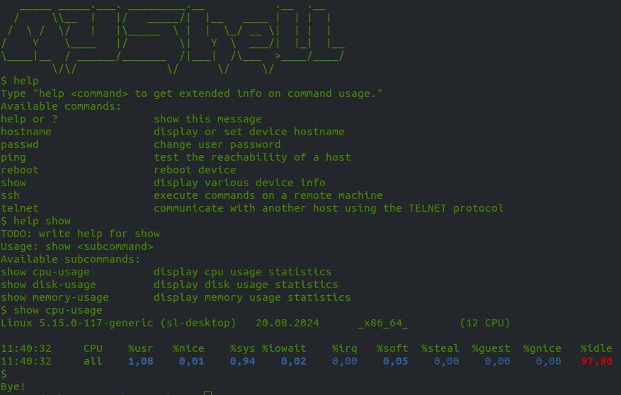

# MYShell

Иногда для собственного устройства требуется шелл с ограниченным функционалом. Этот проект поможет
быстро создать такой шелл.



## Структура проекта

```
myshell
  myshell
  banner
  config
  commands
    <command1>
      description.txt
      help.txt
      <command1>
    <command2>
      ...
    ...
```

myshell -- исполняемый файл, точка входа в оболочку.

В подкаталоге commands созданы каталоги для каждой команды.
В каталоге команды содержится исполняемый файл с тем же названием, а так же файлы
- description.txt - его содержимое показывается при формировании списка команд по команде help
- help.txt - его содержимое показывается при формировании детальной справки по команде help <command>
Если description.txt отсутствует, команда не будет упомянута в списке команд, но при этом будет выолняться.
Если отсутствует help.txt то при вызове help <command> будет запущен исполняемый файл <command> c параметром --help

Содержимое файла banner показывается один раз при запуске оболочки.

Файл config содержит настраиваемые параметры. Вроде бы назначение параметров должно быть интуитивно понятно.

## Как добавить команду

1. В подкаталоге commands создать каталог с именем команды

2. Если нужно чтобы команда отображалась в списке доступных команд, 
создать файл description.txt с кратким описанием команды

3. Если добавляемая команда не содержит встроенной справки или нужно 
переопределить встроенную справку, создать файл help.txt с детальным 
описанием команды.

4. Если команда является алиасом существующей системной утилиты, то 
запустить скрипт myshell-update-existing-symlinks из подкаталога commands. 
Автоматически будет создана символическая ссылка на одноименную утилиту. 

5. Иначе поместить в созданный подкаталог команды одноименный исполняемый 
файл, реализующий нужную логику.

## Установка оболочки

Для облегчения установки оболочки есть скрипт myshell-install-on-device
```
myshell-install-on-device <user>@<host> <port>
```
Скрипт автоматически скопирует нужные файлы по ssh в каталог /usr/bin/myshell 
на заданном устройстве и сформирует символические ссылки для установленных на 
устройстве утилит.

## Что еще нужно сделать

1. Для ввода команд сейчас используется стандартный read. Найти более продвинутую 
реализацию, поддерживающую историю и автозамену. Если нет, то написать свою.

2. Реализовать переключение режимов с различными наборами команд.
